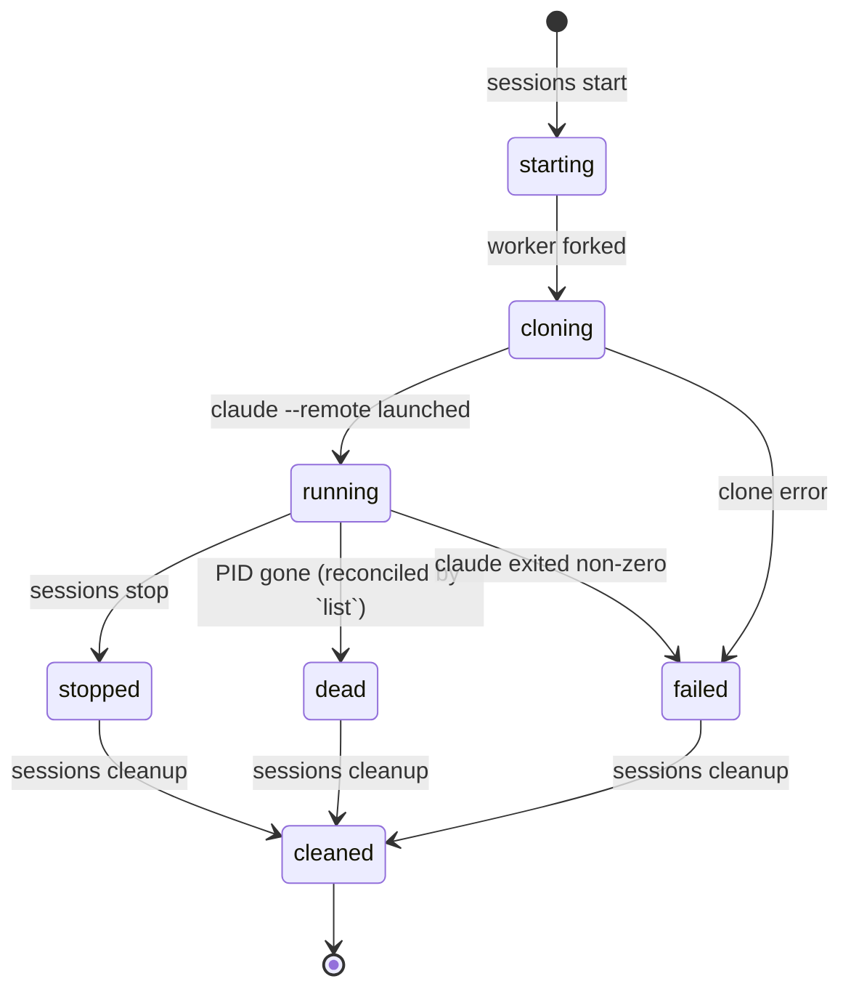

# pictl CLI summary

`pictl` is a CLI for managing Claude Code sessions on a Raspberry Pi.
Every subcommand prints a single JSON object to stdout and exits 0 on
success; failures print `{"error": "<msg>"}` and exit 1 (130 on
Ctrl-C). No flags are global — each subcommand parses its own.

```
pictl <group> [action] [options]
```

Groups: `stats`, `version`, `doctor`, `sessions`, `repos`, `pats`.
(`_session_worker` exists but is internal — invoked by the detached
worker fork; don't call it directly.)

State lives under `~/.pictl/` (override with `PICTL_HOME`):

```
~/.pictl/
├── config.json        # repos + PATs (mode 0600, plaintext tokens)
├── sessions.json      # session metadata
├── sessions/<id>/     # cloned repo + claude logs, one dir per session
├── .askpass.py        # GIT_ASKPASS shim — keeps PATs out of argv
├── .cpu-sample.json   # cached /proc/stat sample
└── .locks/            # advisory fcntl locks
```

Writes are atomic (temp file + `os.replace`) and serialised by an
advisory `fcntl` lock per data file. Reads take a shared lock so
concurrent reads don't block each other. If a JSON file ever fails to
parse, it's renamed to `<name>.corrupt-<unix-ts>` (preserving the bad
content for inspection) and the default shape is returned.

PATs reach `git` via `GIT_ASKPASS`, never via the URL or argv — so
`ps`, audit logs, and core dumps don't capture the token.

---

## Session lifecycle



---

## `pictl stats`

```
pictl stats
```

Snapshot of the host. CPU is sampled by diffing `/proc/stat` against a
cached prior sample (under `~/.pictl/.cpu-sample.json`); only the very
first call after a long idle pays the 0.5 s sleep.

| field             | type         | source                                  |
| ----------------- | ------------ | --------------------------------------- |
| `cpu_percent`     | float        | `1 − idle/total` over the sample window |
| `ram_used_gb`     | float        | `MemTotal − MemAvailable`               |
| `ram_total_gb`    | float        | `/proc/meminfo`                         |
| `disk_used_gb`    | float        | `shutil.disk_usage("/")`                |
| `disk_total_gb`   | float        |                                         |
| `temp_celsius`    | float / null | `vcgencmd`, else `/sys/class/thermal`   |
| `uptime_seconds`  | int          | `/proc/uptime`                          |
| `active_sessions` | int          | status=`running` **and** PID alive      |

---

## `pictl version`

```
pictl version
```

Returns `{"version": "...", "commit": "abc1234"}` (commit is
best-effort from `git rev-parse`; absent if the install is not a
checkout).

---

## `pictl doctor`

```
pictl doctor
```

Runs a battery of environment checks:

- Python ≥ 3.10
- `git` on PATH
- `claude` on PATH
- temperature source (`vcgencmd` or `/sys/class/thermal`)
- `~/.pictl` exists with mode 0700
- `~/.pictl/config.json` mode 0600 (or absent)
- `~/.local/bin` on `PATH`

Each check has `{"name", "ok", "detail"}` plus `"hint"` when failing.
Exits 1 if any check fails, 0 otherwise — convenient for shell guards.

---

## `pictl sessions …`

A session is one `claude --remote` process running against a
freshly-cloned working copy.

### `sessions list`

Returns `{"sessions": [...]}`. Reconciles each `running` record
against its PID — if the PID is gone the record is flipped to `dead`
and persisted back to `sessions.json`.

### `sessions start --repo <repo_id> --branch <name>`

Reserves an id, writes a `starting` record, and forks a detached
worker that clones the repo, launches `claude --remote`, and tails the
claude log for up to 30s looking for `ssh `, `https://`, or
`claude.ai/` lines (capped at 40) to capture as `remote_code`. On the
first match the worker keeps reading for ~2 s grace so multi-line
announcements (URL + ssh hint) are captured together. Returns
immediately (~10ms).

The whole worker is bounded by a 15-minute ceiling so a misbehaving
`claude --remote` can never hang it forever.

### `sessions stop <id>`

`SIGTERM` the PID, wait up to 5s, then `SIGKILL`. Writes
`status=stopped` and `stopped_at`. Errors if the session id is
unknown; a no-op on the process if it's already gone.

### `sessions cleanup <id>`

Stops the session if still live, then `rm -rf`s
`~/.pictl/sessions/<id>/` and removes the record from `sessions.json`.

### `sessions cleanup-dead`

Bulk-cleans every session in a terminal state (`dead`, `failed`,
`stopped`). Returns `{"cleaned": [...], "count": N}` and an
`"errors"` array if any individual cleanup raised.

### `sessions logs <id> [--tail N]`

Returns paths + tails of `claude.log` and `worker.log`:

```json
{
  "id": "...",
  "log_path": "...",
  "worker_log_path": "...",
  "claude_tail": "...",
  "worker_tail": "..."
}
```

`--tail` is in bytes (default 8192).

---

## `pictl repos …`

Repos are stored in canonical `host/owner/repo` form (no scheme, no
`.git`). PATs are passed to git via `GIT_ASKPASS`, never by URL.

### `repos list`

`{"repos": [{"id","name","url","pat_id"}, ...]}`.

### `repos add --url <url> [--pat <pat_id>]`

Accepts `https://github.com/u/r`, `github.com/u/r`,
`git@github.com:u/r.git`, with or without `.git`. Validates the PAT
id if supplied. Duplicate URLs are **not** rejected — add-dedup is
caller-side.

### `repos update <id> [--url ...] [--pat ...] [--clear-pat]`

Mutates an existing repo. Pass `--clear-pat` to detach the current
PAT (subsequent clones go anonymous). At least one of the flags is
required.

### `repos remove <id>`

Removes the record. If any session with status `running` or
`starting` references it, the response includes a `warnings` array
listing those session ids — the repo is still removed.

### `repos branches <id>`

`git ls-remote --heads` against the stored URL. Returns
`{"repo_id": "...", "branches": ["main", ...]}`. 30s timeout.

---

## `pictl pats …`

Personal access tokens. Stored in plaintext in `~/.pictl/config.json`
(mode 0600, single-user Pi). `list` never returns the raw token.

### `pats list`

`{"pats": [{"id","name","token_preview"}, ...]}`. Preview is
`abcd...wxyz` (first-4…last-4), or `a…z` for tokens ≤ 8 chars.

### `pats add --name <label> --token <value>`

Both fields required. Returns the public (masked) record.

### `pats remove <id>`

Removes the PAT. If any repo still references it, the response
includes a `warnings` array listing those repo ids — the PAT is
still removed (and subsequent clones of those repos will fall back
to anonymous HTTPS).

---

## `pictl exec --json '<blob>'`

JSON dispatch entry point used by the mobile UI bridge. The blob is one
object: `{"command": "...", "action": "...", "args": {...}}`. Routes to
the same handlers the argparse path uses, so behaviour can never drift
between the human and programmatic surfaces.

```
pictl exec --json '{"command":"sessions","action":"start","args":{"repo":"abc123","branch":"main"}}'
```

`action` is omitted/ignored for groupless commands (`stats`, `version`,
`doctor`). `args` is omitted or `{}` when nothing is needed.

**Exit codes diverge from the argparse path on purpose for `doctor`:**
the human form (`pictl doctor`) exits 1 on any failed check so shell
guards work, but `pictl exec --json '{"command":"doctor"}'` always
exits 0 on a successful dispatch. UIs read `ok: false` from the body —
exiting 1 would force them into a generic error-path that has to scrape
out the report.

All other failure modes (unknown command, missing required arg, handler
raising `PictlError`) still emit `{"error":"..."}` and exit 1.

This exists because UIs already speak JSON: forcing them to re-encode
each value as a `--flag` and then scrape argparse stderr for errors is
busy-work that adds a second source of truth. With `exec --json`, the
UI's request schema and the CLI's dispatch table model the same thing.

---

## Exit codes

| code | meaning                                            |
| ---- | -------------------------------------------------- |
| 0    | success; JSON object on stdout                     |
| 1    | `PictlError` or unknown action; `{"error": "..."}` |
| 1    | `pictl doctor` reports any failing check           |
| 130  | `KeyboardInterrupt`                                |

## Tips

- Pipe output through `python3 -m json.tool` for pretty-printing.
- Set `PICTL_HOME=/some/path` to relocate the data dir (useful for
  tests).
- `pictl doctor` is the fastest way to diagnose a broken install.
